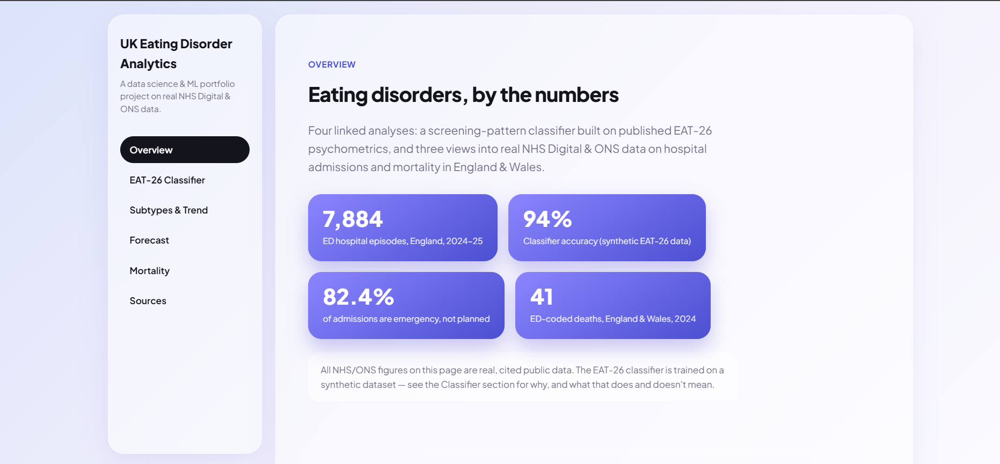
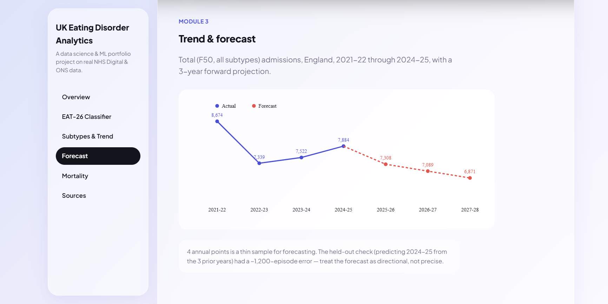

# UK Eating Disorder Analytics — Risk Pattern Classifier (Module 1)

This is the first working module of the larger UK Eating Disorder Trends
& Forecasting project: a **multi-class ML classifier** that predicts a
symptom "risk pattern" (aligned to Anorexia/Bulimia/Binge-type profiles)
from EAT-26-style screening scores.

## ⚠️ Scope & Ethics (read this first)

- This is a **screening-pattern demo, not a diagnostic tool**. EAT-26
  itself is a validated *screening* instrument, not a diagnosis — a
  score above the clinical cutoff means "seek a professional
  evaluation," not "has an eating disorder."
- The dataset here is **synthetic**. Real, respondent-level EAT-26 data
  isn't publicly available (it's sensitive health data), so
  `src/generate_eat26_dataset.py` generates data whose class-conditional
  subscale patterns are grounded in published EAT-26 psychometrics
  (Garner et al., 1982, and subsequent validation studies), not real
  patient records.
- This project is built for a **data science / ML portfolio**, to
  demonstrate an end-to-end classification pipeline on a genuinely
  interesting, well-documented healthcare use case.

## What's in this module

- `src/generate_eat26_dataset.py` — generates the synthetic dataset
  (3,000 rows, 4 classes: Low Risk, Restrictive/AN-type, Bulimic/BN-type,
  Binge/BED-type)
- `src/eat26_classifier.py` — EDA + trains and compares two models
  (Random Forest, Logistic Regression), saves plots and the best model

## Results (current run)

| Model | Accuracy | Macro F1 |
|---|---|---|
| Random Forest | 0.940 | 0.920 |
| Logistic Regression | 0.943 | 0.921 |

Confusion between **Bulimic (BN-type)** and **Binge (BED-type)** is the
main error source — which mirrors real clinical difficulty, since both
involve elevated Bulimia/Food-Preoccupation subscale scores and lower
Oral Control scores; the main separator is Dieting-subscale severity.

Figures saved to `reports/figures/`:
- `class_distribution.png`
- `subscale_distributions.png` — shows how each class's Dieting/Bulimia/Oral
  Control scores differ (this is what the model learns from)
- `bmi_vs_risklabel.png`
- `confusion_matrix_random_forest.png`, `confusion_matrix_logistic_regression.png`
- `feature_importance.png`

## How to run

```bash
pip install -r requirements.txt
python src/generate_eat26_dataset.py   # creates data/processed/eat26_synthetic.csv
python src/eat26_classifier.py         # runs EDA + trains + evaluates + saves model
```

## Module 2 — Real NHS Digital Data (2024-25 snapshot)

Source: NHS Digital, *Hospital Admitted Patient Care Activity 2024-25*,
diagnosis summary file (`hosp-epis-stat-admi-diag-2024-25.csv`), filtered
to ICD-10 F50.x (eating disorders).
https://digital.nhs.uk/data-and-information/publications/statistical/hospital-admitted-patient-care-activity/2024-25

- `src/load_nhs_diagnosis_data.py` — parses the raw long-format NHS file
  into a clean subtype table (`data/processed/nhs_ed_subtypes_2024-25.csv`)
  and an age-band breakdown
  (`data/processed/nhs_ed_age_breakdown_2024-25.csv`)
- `src/eda_nhs_subtypes.py` — EDA: subtype breakdown, gender split, age
  pattern by subtype

**Key findings (England, 2024-25):**
- 7,884 total eating disorder hospital episodes
- Anorexia Nervosa is the largest single subtype (51.6%, 94% female)
- "Eating Disorder, Unspecified" is second largest (28.8%) — a real data
  quality/coding-practice finding worth discussing
- Sharp admission spike at ages 10-14 across *all* subtypes, plus a
  distinct second peak for Anorexia specifically at ages 20-24
- 82.4% of admissions are emergency admissions — very low elective/planned
  share, consistent with eating disorders often reaching crisis point
  before treatment

Figures: `nhs_subtype_admissions.png`, `nhs_gender_split.png`,
`nhs_age_pattern.png`

**Limitation:** this is a single financial year. For the forecasting
module (below), the same `admi-diag` file is needed from several earlier
editions of the same NHS Digital publication.

## Module 3 — Real Multi-Year Trend & Forecast (2021-22 to 2024-25)

Source: NHS Digital, same *Hospital Admitted Patient Care Activity*
diagnosis files, 4 editions (2021-22, 2022-23, 2023-24, 2024-25).
Two file formats needed two loaders:
- `src/load_nhs_diagnosis_data.py` — 2024-25 (long-format CSV)
- `src/load_nhs_diagnosis_xlsx.py` — 2021-22/2022-23/2023-24 (wide-format
  Excel, column names vary slightly by year — handled with flexible
  keyword matching)

Merged into `data/processed/nhs_ed_subtypes_all_years.csv` and
`data/processed/f50_yearly_series.csv` (the F50 total, one row per year).

**Real trend (all-subtype total, FCEs):**
| Year | Admissions |
|---|---|
| 2021-22 | 8,674 |
| 2022-23 | 7,339 |
| 2023-24 | 7,522 |
| 2024-25 | 7,884 |

Dip after 2021-22, then recovering.

`src/forecast_admissions.py` fits a linear trend and Holt's Linear
Exponential Smoothing on this series and projects 3 years ahead.

**Honesty note:** 4 annual points is a thin sample for forecasting.
The held-out check (predicting 2024-25 from the 3 prior years) had a
~1,200-episode error, and both models converge to nearly the same
projection since there's not enough data to distinguish trend shapes.
Treat the forecast as directional, not precise — more years (if found/
released) would meaningfully improve this.

Figure: `admissions_forecast.png`

## Module 4 — ONS Mortality by Region (2024)

Source: ONS via Nomis, mortality statistics (underlying cause), F50
eating disorders vs all-cause deaths, by region, 2024.
`src/load_ons_mortality.py` → `data/processed/ons_ed_mortality_2024.csv`,
`reports/figures/ons_mortality_by_region.png`

**Total: 41 eating-disorder-coded deaths across England & Wales, 2024.**
Highest: South East (9), Wales & London (7 each). Lowest: North East,
West Midlands (1 each).

**Honesty note:** these are very small counts (max 9 per region) — normal
year-to-year noise can easily produce differences this size. Don't
over-read the regional ranking; it's useful for context, not a reliable
"riskier region" claim. Worth pairing with multiple years if you find them.

## Dashboard Preview





